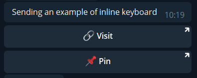
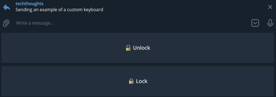

# PoshGram - Advanced

*Consider exploring the [PoshGram Basics](PoshGram-Basics.md) page first to gain a comprehensive understanding of the tool and its features before proceeding to the advanced page.*

## Messages

### Escaping Characters

```powershell
$botToken = 'nnnnnnnnn:xxxxxxx-xxxxxxxxxxxxxxxxxxxxxxxxxxx'
$chatID = '-nnnnnnnnn'
$sendTelegramTextMessageSplat = @{
    BotToken  = $botToken
    ChatID    = $chatID
    ParseMode = 'MarkdownV2'
    Message   = 'This is how to escape an __underscore__ in a message: \_'
}
Send-TelegramTextMessage @sendTelegramTextMessageSplat
```

### Sending emojis

#### Discovering emoji information

*Note: PoshGram includes the module [pwshEmojiExplorer](https://pwshemojiexplorer.readthedocs.io/) which can help you search for and identify various emoji formats for including in your messages*

```powershell
# example  of finding emoji information using pwshEmojiExplorer
Import-Module pwshEmojiExplorer
Get-Emoji -SearchTerm 'cool' | fl *

Group             : Symbols
Subgroup          : alphanum
HexCodePoint      : 1F192
Status            : fully-qualified
Name              : 🆒
Version           : E0.6
Description       : COOL button
ShortCode         : :COOL_button:
HexCodePointArray : {1F192}
UnicodeStandard   : {U+1F192}
HTMLEntityFormat  : {&#x1F192}
pwshEscapedFormat : `u{1F192}
Decimal           : {127378}
```

#### Method 1 - PowerShell escaped unicode

Send emojis using PowerShell escaped unicode.

```powershell
$botToken = 'nnnnnnnnn:xxxxxxx-xxxxxxxxxxxxxxxxxxxxxxxxxxx'
$chatID = '-nnnnnnnnn'
$sendTelegramTextMessageSplat = @{
    BotToken  = $botToken
    ChatID    = $chatID
    ParseMode = 'MarkdownV2'
    Message   = "`u{1F192} Sending emojis is cool\! `u{1F49B}"
}
Send-TelegramTextMessage @sendTelegramTextMessageSplat
```

#### Method 2 - HTML Entity Format

Send emojis using the HTML entity hex format.

```powershell
$botToken = 'nnnnnnnnn:xxxxxxx-xxxxxxxxxxxxxxxxxxxxxxxxxxx'
$chatID = '-nnnnnnnnn'
$uniCodeEmoji = 'U+1F601'
$hexEmoji = $uniCodeEmoji.Replace('U+','&#x')
Send-TelegramTextMessage -BotToken $botToken -ChatID $chatID -Message "This is a smiley face: $hexEmoji"
```

#### Method 3 - Emoji

Directly use the emoji character in your message.

```powershell
$botToken = 'nnnnnnnnn:xxxxxxx-xxxxxxxxxxxxxxxxxxxxxxxxxxx'
$chatID = '-nnnnnnnnn'
$emoji = '😔'
Send-TelegramTextMessage -BotToken $botToken -ChatID $chatID -Message "This is a sad face: $emoji"
```

#### Emoji example using pwshEmojiExplorer directly

This example demonstrates how to integrate pwshEmojiExplorer directly into your messaging workflow.

```powershell
$emoji = Get-Emoji -SearchTerm 'milky way'
$botToken = 'nnnnnnnnn:xxxxxxx-xxxxxxxxxxxxxxxxxxxxxxxxxxx'
$chatID = '-nnnnnnnnn'
Send-TelegramTextMessage -BotToken $botToken -ChatID $chatID -Message "Using emojis with PoshGram is out of this world! $($emoji.Name)"
```

### Keyboards

The Telegram Bot API supports two types of keyboards:

- **Inline Keyboards**
    - 

      > Inline Keyboards that are shown directly below their relevant messages.
      Unlike with custom reply keyboards, pressing buttons on inline keyboards doesn't send messages to the chat. Instead, inline keyboards support buttons that can work behind the scenes or open different interfaces

- **Custom Keyboards**
    - 

      > Can display a special keyboard with predefined reply options. Using any of the buttons will immediately send the respective text.

See the official documentation on Telegram Keyboards for more info: [Telegram Keyboards](https://core.telegram.org/bots/features#keyboards)

Keyboards are formed using an *Array of Arrays*.

Essentially, the arrays represents rows and columns of keyboard buttons. See below for examples:

#### Inline Keyboard

In this example we send a basic inline keyboard. Note the outcomes of this keyboard will not result in a message being sent, rather the user will visit a link when pressed.

```powershell
$inlineRow1 = @(
    @{
        text = "`u{1F517} Visit"
        url  = 'https://www.techthoughts.info'
    }
)
$inlineRow2 = @(
    @{
        text = "`u{1F4CC} Pin"
        url  = 'https://www.techthoughts.info/learn-powershell-series/'
    }
)
$inlineKeyboard = @{
    inline_keyboard = @(
        $inlineRow1,
        $inlineRow2
    )
}
$botToken = 'nnnnnnnnn:xxxxxxx-xxxxxxxxxxxxxxxxxxxxxxxxxxx'
$chatID = '-nnnnnnnnn'
$sendTelegramTextMessageSplat = @{
    BotToken = $botToken
    ChatID   = $chatID
    Message  = 'Sending an example of inline keyboard'
    Keyboard = $inlineKeyboard
}
Send-TelegramTextMessage @sendTelegramTextMessageSplat
```

#### Custom Keyboard

In this example we send a basic inline keyboard. Note the outcomes of this keyboard will send a predefined message to the chat.

```powershell
$row1 = @(
    @{
        text = "`u{1F513} Unlock"
    }
)
$row2 = @(
    @{
        text = "`u{1F512} Lock"
    }
)
$customKeyboard = @{
    keyboard          = @(
        $row1,
        $row2
    )
    one_time_keyboard = $true
    is_persistent     = $false
}
$botToken = 'nnnnnnnnn:xxxxxxx-xxxxxxxxxxxxxxxxxxxxxxxxxxx'
$chatID = '-nnnnnnnnn'
$sendTelegramTextMessageSplat = @{
    BotToken = $botToken
    ChatID   = $chatID
    Message  = 'Sending an example of a custom keyboard'
    Keyboard = $customKeyboard
}
Send-TelegramTextMessage @sendTelegramTextMessageSplat
```
