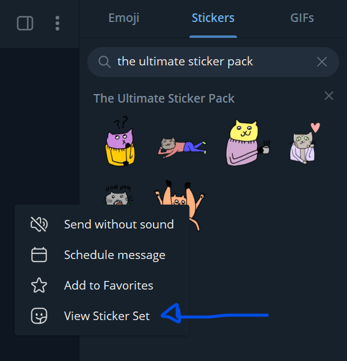
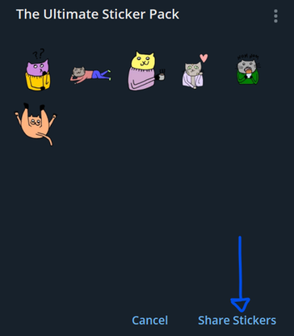

# Send stickers using PoshGram

*How can I use PoshGram to get my bot to send stickers?*

## 4 ways to send stickers

### 1 - Send-TelegramLocalSticker

- This sends a locally sourced sticker (.WEBP/.TGS)
- `Send-TelegramLocalSticker -BotToken $botToken -ChatID $chat -StickerPath $sticker`

### 2 - **Send-TelegramURLSticker**

- This sends a sticker (.WEBP/.TGS) located at a specified URL
- `Send-TelegramURLSticker -BotToken $token -ChatID $channel -StickerURL $StickerURL`

### 3 - **Send-TelegramSticker** by file_id

- You already know the file_id of the sticker you want to send
- `Send-TelegramSticker -BotToken $botToken -ChatID $chat -FileID $sticker`
    - If you *do not know* the file_id, you can leverage ***Get-TelegramStickerPackInfo*** to determine that information:
        - `Get-TelegramStickerPackInfo -BotToken $botToken -StickerSetName STPicard`

### 4 - **Send-TelegramSticker** by Sticker pack name + emoji shortcode

Via this method you can provide the name of the sticker pack.

- *Ex. STPicard*
- *Ex. CookieMonster*

You also provide the emoji shortcode of the emoji you are trying to convey.

- *Ex. ':<zero-width space>slightly_smiling_face:'*
- *Ex. ':<zero-width space>grinning:'*

**Notes around this method:**

- Sticker packs are controlled by their *author*
    - Not every sticker has a corresponding emoji
    - Some sticker authors have the same emoji linked to multiple stickers
- This method will make a best attempt to look up the sticker pack you specify and send a sticker that matches the corresponding emoji shortcode.

If you don't want to have a *best attempt* scenario, use ***Get-TelegramStickerPackInfo*** to determine the exact file_id's from the sticker pack you'd like to send.


## Getting sticker info

To find the name of a sticker pack use the telegram app to share the sticker pack. This will provide a link which contains the sticker pack name.





The share button produces the link: `https://t.me/addstickers/FriendlyFelines` which means the sticker pack name is `FriendlyFelines`.

Armed with this sticker pack information can now be retrieved:

```powershell
 Get-TelegramStickerPackInfo -BotToken $token -StickerSetName 'FriendlyFelines'

width          : 512
height         : 512
emoji          : 🤔
set_name       : FriendlyFelines
is_animated    : False
is_video       : False
type           : regular
thumbnail      : @{file_id=AAMCAQADFQABZYu1cOK1Wuj4kam7iXELT8yajXkAAgEAA5RF2x1XpRoi4-PdMgEAB20AAzME;
                 file_unique_id=AQADAQADlEXbHXI; file_size=3970; width=128; height=128}
thumb          : @{file_id=AAMCAQADFQABZYu1cOK1Wuj4kam7iXELT8yajXkAAgEAA5RF2x1XpRoi4-PdMgEAB20AAzME;
                 file_unique_id=AQADAQADlEXbHXI; file_size=3970; width=128; height=128}
file_id        : CAACAgEAAxUAAWWLtXDitVro-JGpu4lxC0_Mmo15AAIBAAOURdsdV6UaIuPj3TIzBA
file_unique_id : AgADAQADlEXbHQ
file_size      : 19114
Bytes          : {62, 216, 20, 221}
Code           : U+1F914
Shortcode      : :thinking_face:

width          : 512
height         : 512
emoji          : 😀
set_name       : FriendlyFelines
is_animated    : False
is_video       : False
type           : regular
thumbnail      : @{file_id=AAMCAQADFQABZYu1cIYVlyV2cVEzPsfzFQMcuXgAAgIAA5RF2x3Sz_hda9kofAEAB20AAzME;
                 file_unique_id=AQADAgADlEXbHXI; file_size=3088; width=128; height=128}
thumb          : @{file_id=AAMCAQADFQABZYu1cIYVlyV2cVEzPsfzFQMcuXgAAgIAA5RF2x3Sz_hda9kofAEAB20AAzME;
                 file_unique_id=AQADAgADlEXbHXI; file_size=3088; width=128; height=128}
file_id        : CAACAgEAAxUAAWWLtXCGFZcldnFRMz7H8xUDHLl4AAICAAOURdsd0s_4XWvZKHwzBA
file_unique_id : AgADAgADlEXbHQ
file_size      : 16266
Bytes          : {61, 216, 0, 222}
Code           : U+1F600
Shortcode      : :grinning:

width          : 512
height         : 512
emoji          : ☕️
set_name       : FriendlyFelines
is_animated    : False
is_video       : False
type           : regular
thumbnail      : @{file_id=AAMCAQADFQABZYu1cCpgnoOBAAGY4gnYp8t76I5MAAIDAAOURdsdKQAB5S7_KsKFAQAHbQADMwQ;
                 file_unique_id=AQADAwADlEXbHXI; file_size=5384; width=128; height=128}
thumb          : @{file_id=AAMCAQADFQABZYu1cCpgnoOBAAGY4gnYp8t76I5MAAIDAAOURdsdKQAB5S7_KsKFAQAHbQADMwQ;
                 file_unique_id=AQADAwADlEXbHXI; file_size=5384; width=128; height=128}
file_id        : CAACAgEAAxUAAWWLtXAqYJ6DgQABmOIJ2KfLe-iOTAACAwADlEXbHSkAAeUu_yrChTME
file_unique_id : AgADAwADlEXbHQ
file_size      : 34292
Bytes          : {21, 38, 15, 254}
Code           : U+2615
Shortcode      : :coffee:

width          : 512
height         : 512
emoji          : ❤️
set_name       : FriendlyFelines
is_animated    : False
is_video       : False
type           : regular
thumbnail      : @{file_id=AAMCAQADFQABZYu1cCMwS6SUM-pgop_NePlUj7IAAgQAA5RF2x1Ckc6QIJNqFwEAB20AAzME;
                 file_unique_id=AQADBAADlEXbHXI; file_size=3670; width=128; height=128}
thumb          : @{file_id=AAMCAQADFQABZYu1cCMwS6SUM-pgop_NePlUj7IAAgQAA5RF2x1Ckc6QIJNqFwEAB20AAzME;
                 file_unique_id=AQADBAADlEXbHXI; file_size=3670; width=128; height=128}
file_id        : CAACAgEAAxUAAWWLtXAjMEuklDPqYKKfzXj5VI-yAAIEAAOURdsdQpHOkCCTahczBA
file_unique_id : AgADBAADlEXbHQ
file_size      : 20398
Bytes          : {100, 39, 15, 254}
Code           : U+2764 U+FE0F
Shortcode      : :heart:

width          : 512
height         : 512
emoji          : 🤤
set_name       : FriendlyFelines
is_animated    : False
is_video       : False
type           : regular
thumbnail      : @{file_id=AAMCAQADFQABZYu1cA2uIK-i2AjGXEzqJeBG54IAAgUAA5RF2x0qZsIzvDWrLgEAB20AAzME;
                 file_unique_id=AQADBQADlEXbHXI; file_size=4070; width=128; height=128}
thumb          : @{file_id=AAMCAQADFQABZYu1cA2uIK-i2AjGXEzqJeBG54IAAgUAA5RF2x0qZsIzvDWrLgEAB20AAzME;
                 file_unique_id=AQADBQADlEXbHXI; file_size=4070; width=128; height=128}
file_id        : CAACAgEAAxUAAWWLtXANriCvotgIxlxM6iXgRueCAAIFAAOURdsdKmbCM7w1qy4zBA
file_unique_id : AgADBQADlEXbHQ
file_size      : 21948
Bytes          : {62, 216, 36, 221}
Code           : U+1F924
Shortcode      : :drooling_face:

width          : 512
height         : 512
emoji          : 🙃
set_name       : FriendlyFelines
is_animated    : False
is_video       : False
type           : regular
thumbnail      : @{file_id=AAMCAQADFQABZYu1cB2yrcbd0E91smX7BY21xP4AAgYAA5RF2x0NT-731Ay-KQEAB20AAzME;
                 file_unique_id=AQADBgADlEXbHXI; file_size=4830; width=128; height=128}
thumb          : @{file_id=AAMCAQADFQABZYu1cB2yrcbd0E91smX7BY21xP4AAgYAA5RF2x0NT-731Ay-KQEAB20AAzME;
                 file_unique_id=AQADBgADlEXbHXI; file_size=4830; width=128; height=128}
file_id        : CAACAgEAAxUAAWWLtXAdsq3G3dBPdbJl-wWNtcT-AAIGAAOURdsdDU_u99QMvikzBA
file_unique_id : AgADBgADlEXbHQ
file_size      : 23118
Bytes          : {61, 216, 67, 222}
Code           : U+1F643
Shortcode      : :upside_down_face:
```
